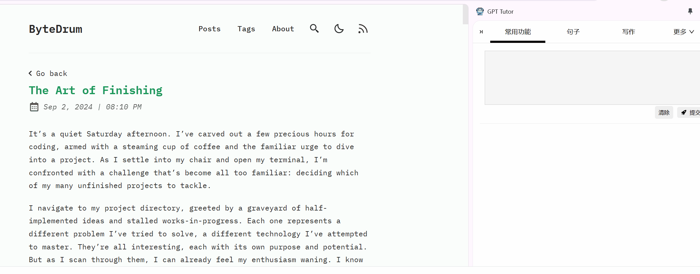

# Change Log

All notable changes to this project will be documented in this file.

The format is based on [Keep a Changelog](https://keepachangelog.com/en/1.0.0/),
and this project adheres to [Semantic Versioning](https://semver.org/spec/v2.0.0.html).

## [1.0.1.7] - 2024-12-08

### 🎉 New Features

- Added operation guides explaining the usage of the main interface.
- Added feature set store, supporting purchase, update, and customization of feature sets based on individual needs.

### 🐛 Bug Fixes
- Fixed an issue where the @ symbol couldn't be used to invoke GPT-Tutor functionality in reading mode.
- Fixed an issue where answers were being saved incorrectly.

### 🎉 New Features
- Added reading mode for more convenient webpage content reading through gpt-tutor.

## [1.0.1.4] - 2024-11-09

### 🎉 New Features
- Added reading mode for more convenient webpage content reading through gpt-tutor.
- Added third-party API provider: openRouter.

### 🔄 Changes
- Removed built-in review functionality, replaced with Anki integration.
- Removed clerk usage from initial page, login no longer required.
- Implemented state management using zustand.

## [1.0.1.3] - 2024-09-14

### 🎉 New Features
- Redesigned the main page UI for better intuitiveness and simplicity.
- Functionality selection is now done through top tabs, with the "More" button on the right for accessing additional functionality and settings.
- The @ symbol can now be used to quickly access GPT-Tutor's related features, such as accessing word-related features after selecting the word tab.
- History, review records, and word lists are now displayed in the sidebar by default, usually hidden, and can be opened by clicking the |< icon in the top left corner.

- A feedback button has been added to the functionality manager for submitting feedback on a specific feature.
- A ? button has been added to the answer box, allowing users to view improvement plans if they have questions about the current answer.

### 🔄 Changes
- The "Add to Review" button has been moved to the answer box, adding all content of the word to the review upon clicking.
- Non-administrators and subscribers can no longer modify built-in functionality to prevent unnecessary errors.
- The functionality for uploading dictionaries has been moved to the dropdown menu.

### 🐛 Bug Fixes
- Fixed the issue where the Youglish component would still trigger even when hidden.

## [1.0.1.2] - 2024-09-04

### 🎉 New Features
- All built-in feature sets are now fetched from a remote repository (previously loaded locally), and can be updated to the latest version at any time.
- The "Store" component has been added to the Action Manager, allowing users to upload their feature sets to obtain API Key usage quotas, as well as purchase and customize feature sets (`src/common/components/ActionStore.tsx`).
- Feedback settings have been added for built-in features. Users can submit feedback on specific features through the Action Manager or by clicking the question mark button on the answer page.

### 🔄 Changes
- User-created features are now distinguished from GPT-Tutor's built-in features. To ensure functionality, users cannot delete or modify built-in features (but can view them).
- The logic for using bottom buttons has been reworked, removing the "Continue" and "Next" buttons and only keeping the "Add to Review" button.
- The setting for auxiliary actions in the Action Manager has been removed.
- The setting for JSON output format in the Action Manager has been removed.

### 🐛 Bug Fixes
- Fixed the issue where answers generated through input queries (not selecting words from the right-side list) did not display correctly.
- Fixed the issue where using ChatGLM or Kimi would redirect to the settings page on the first page load.
