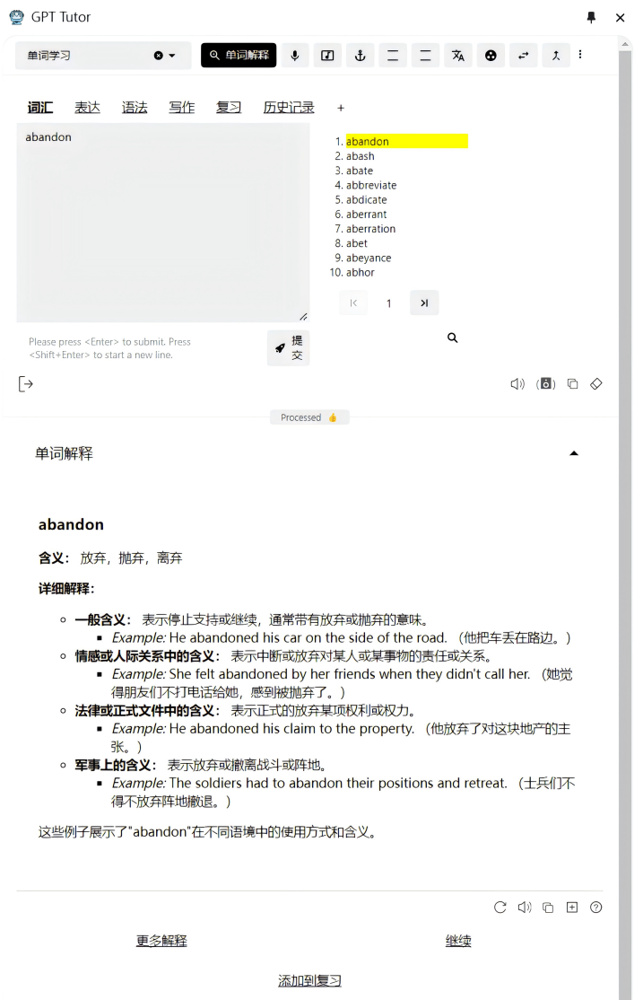
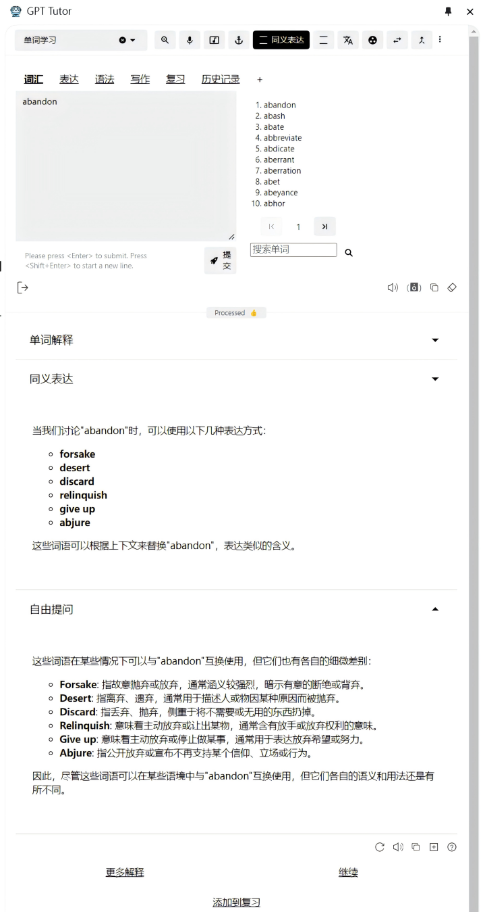
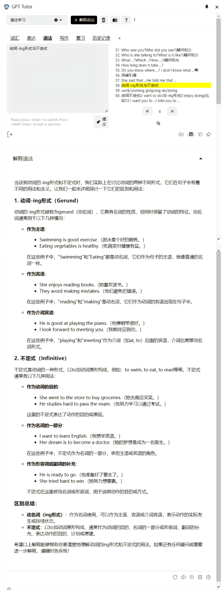
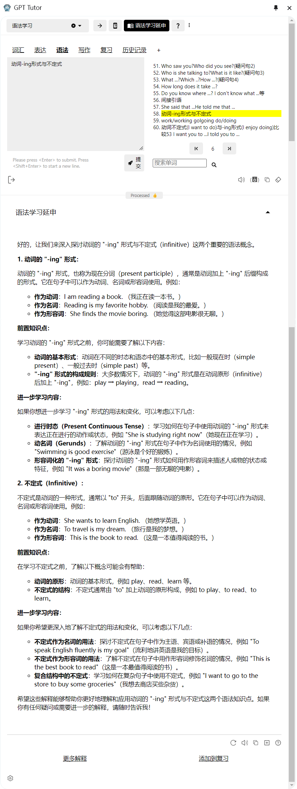

      <a href="README.md">English</a> | 中文

    基于AI的多功能语言学习工具。

# gpt-tutor是什么？
想象如果有这样一个老师：24h无条件、耐心向你解释所有学习问题，可以帮助你学习发音，学习和复习单词、解释你不懂的语法，帮助你精读文章、练习写作，它就是gpt-tutor。

- 使用AI打造一个24h、无条件、耐心向你解释所有读音、单词、语法，并且帮助你阅读文章、练习写作的语言老师。

- 用高质量的AI教育代替教育资源缺乏地区的低质量、无效教育，不用再忍受发音都不准的英语老师。

- 相比市面上现有的单词学习app的功能gpt-tutor都能做到，而且gpt-tutor学习单词的方式更多样、更系统，而且可自定义。

- 支持学习多种语言，并且可以同时学习发音、单词、句子、语法和写作，将整个学习过程串联在一起。

# 使用演示

gpt-tutor包括单词、语法、句子、文章阅读、写作等多方面的学习功能，这里只简单演示单词和语法学习中的两个功能。

**注意**：以下图片中以中文/英文学习为例，但gpt-tutor支持学习的不仅是中文/英文学习。

## 单词学习

### 单词解释

### 同义表达和区别解释

## 语法学习

### 解释语法

### 语法学习延申

# 如何安装

## 1.Chrome应用商店

你可以直接点击链接通过[Chrome应用商店](https://chromewebstore.google.com/detail/gpt-tutor/icbphcgipdflenaemgkhmigfiaelpbnn?hl=en)下载，但是有时候可能因为审核，应用商店上的gpt-tutor并不是最新的版本。

## 2.通过开发者模式直接加载最新版本的安装包

1.点击Release中的**最新版本**

2.点击下载chromium.zip，**解压缩**到本地

3.打开扩展程序，然后点击最下方的**管理扩展程序**

4.打开**开发者模式**

5.打开开发者模式之后，左上角会出现新的按钮，点击**加载已解压的扩展程序**

6.将解压后的文件夹导入，注意需要先打开解压后的文件夹，然后再导入里面的同名文件夹

7.最后点击管理扩展程序，然后将gpt-tutor固定在浏览器上

# License

[LICENSE](./LICENSE)
