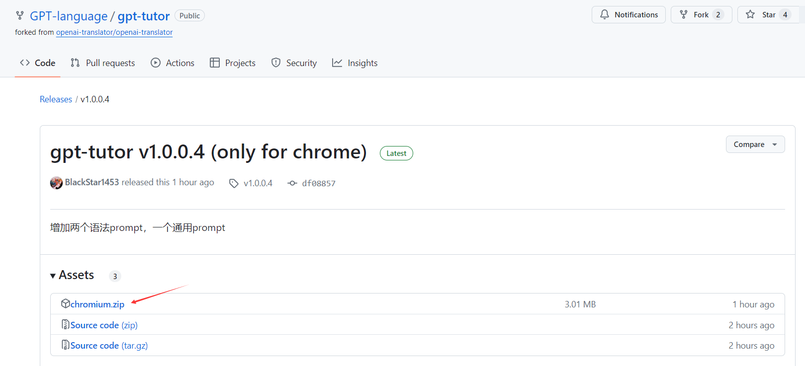
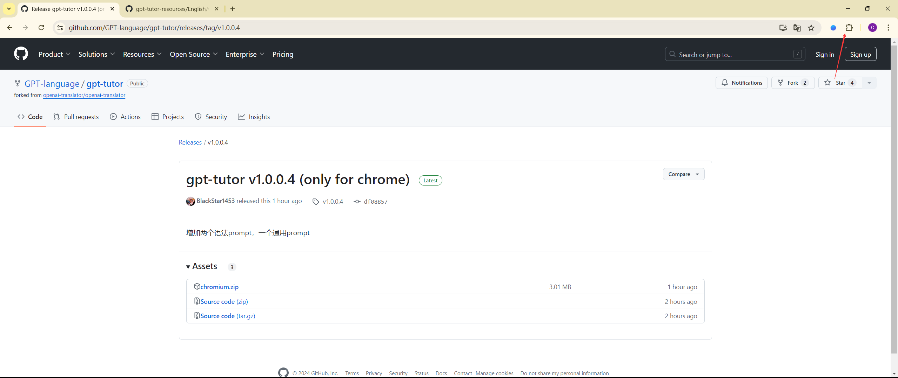
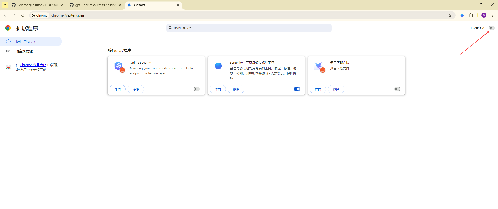
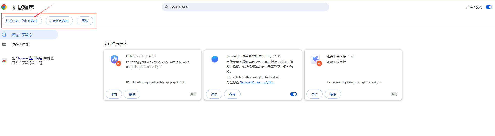

      English | <a href="README-CN.md">中文</a>

    GPT-Tutor is a practical tool that uses AI to provide comprehensive language learning assistance. 

# How to install

## Chrome Web Store

You can directly download it via the [Chrome Web Store](https://chromewebstore.google.com/detail/gpt-tutor/icbphcgipdflenaemgkhmigfiaelpbnn?hl=en), but sometimes the version available in the store might not be the latest due to review delays.

## Load the latest version of the extension package directly via Developer mode.

1.Click on **the latest version** in the Release section

2.Click to download chromium.zip, and **extract** it to your local directory

3.Open the Extensions page, and then click on **Manage Extensions** at the bottom

4.Enable **Developer mode**

5.After enabling Developer mode, a new button will appear in the top left corner. Click on **Load unpacked**.

6.Import the extracted folder. Make sure to first open the extracted folder, then import **the folder with the same name inside it**.

# License

[LICENSE](./LICENSE)

