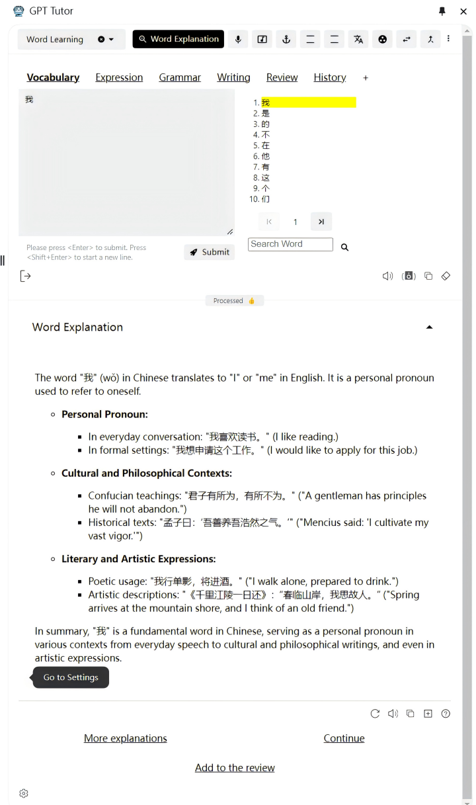
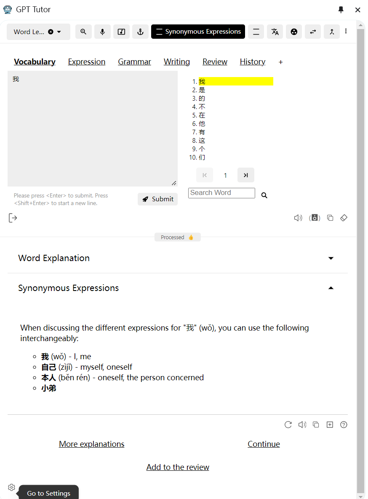
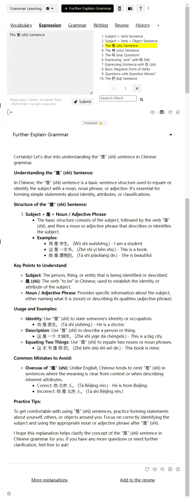
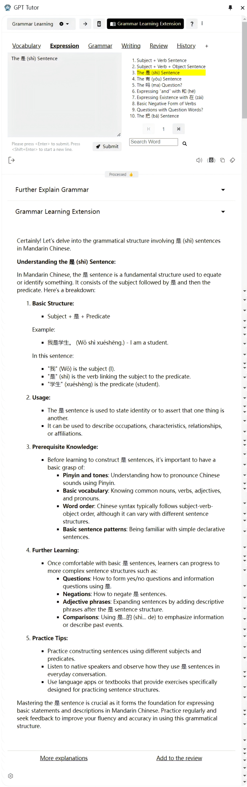
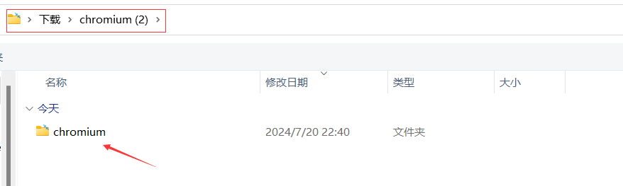
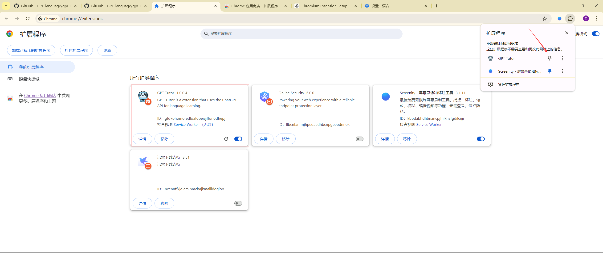

      English | <a href="README-CN.md">中文</a>

    GPT-Tutor is a practical tool that uses AI to provide comprehensive language learning assistance. 

# What is GPT-Tutor？
GPT-Tutor is an AI-powered language learning tool designed to function as a round-the-clock, always-available tutor that offers patient and comprehensive assistance across various aspects of language learning. Here’s what makes it unique:

- 24/7 Availability: GPT-Tutor operates continuously, ready to explain pronunciation, vocabulary, grammar, and assist with reading and writing anytime you need.

- Educational Quality: It aims to replace low-quality and ineffective education in regions lacking educational resources, providing a high-quality alternative to inadequately trained language teachers.

- Advanced Features: Unlike basic vocabulary apps, GPT-Tutor offers a more diverse and systematic way to learn words, customizable to fit different learning styles and needs.

- Multi-Language Support: It supports learning multiple languages, allowing simultaneous study of pronunciation, vocabulary, sentences, grammar, and writing, effectively linking these aspects into a cohesive learning experience.

GPT-Tutor is more than just a tool; it's a comprehensive solution that integrates various learning components into a unified platform, enhancing both the efficiency and effectiveness of language education.

# Demo Usage

gpt-tutor includes various learning functions such as vocabulary, grammar, sentences, reading articles, and writing. Here, we will simply demonstrate two features within vocabulary and grammar learning.

**NOTE**: The following images use Chinese/English learning as examples, but gpt-tutor supports learning not only in Chinese/English.

## Vocabulary Learning

### Word Explanation

### Synonyms and Distinctions

## Grammar Learning

### Grammar Explanation

### Grammar Learning Extension

# How to install

## 1.Chrome Web Store

You can directly download it via the [Chrome Web Store](https://chromewebstore.google.com/detail/gpt-tutor/icbphcgipdflenaemgkhmigfiaelpbnn?hl=en), but sometimes the version available in the store might not be the latest due to review delays.

## 2.Load the latest version of the extension package directly via Developer mode.

1.Click on **the latest version** in the Release section

2.Click to download chromium.zip, and **extract** it to your local directory

3.Open the Extensions page, and then click on **Manage Extensions** at the bottom

4.Enable **Developer mode**

5.After enabling Developer mode, a new button will appear in the top left corner. Click on **Load unpacked**.

6.Import the extracted folder. Make sure to first open the extracted folder, then import **the folder with the same name inside it**.

7.Finally, click on **Manage Extensions**, and then **pin gpt-tutor** to the browser.

# License

[LICENSE](./LICENSE)

